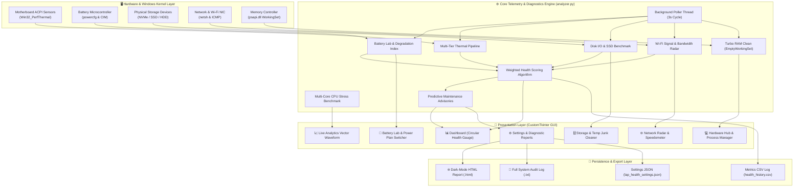
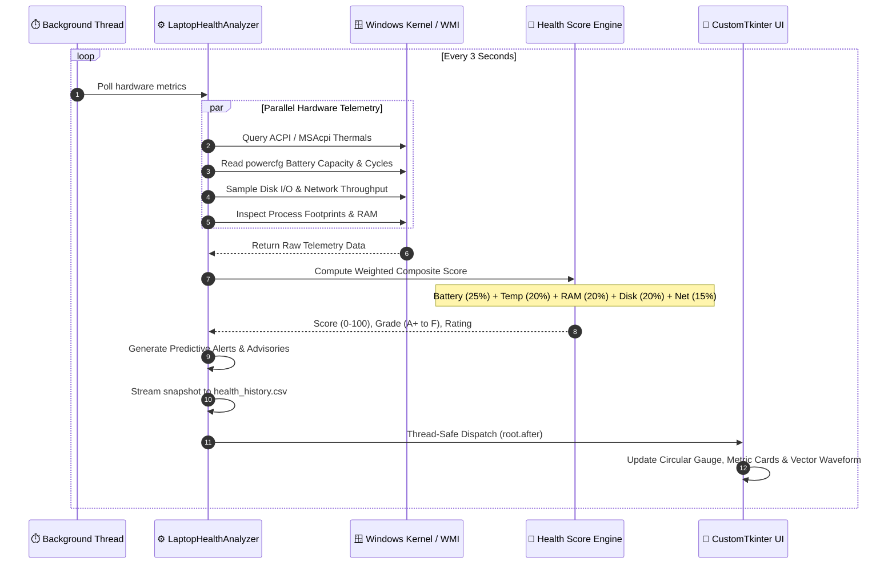
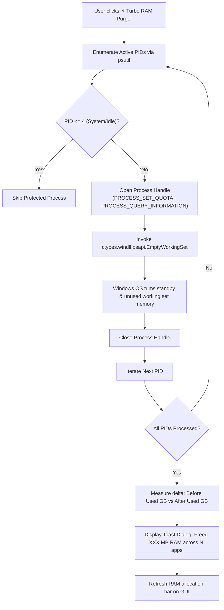
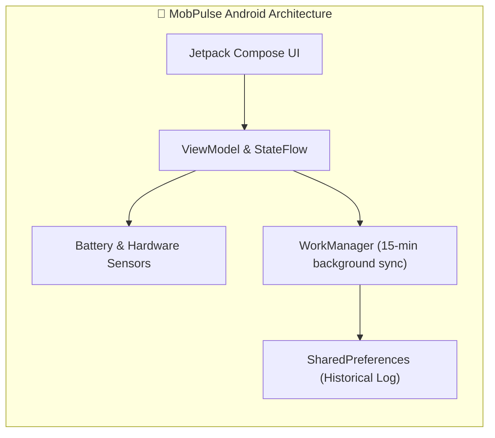

# MobPulse & Laptop Health Suite Pro 📱💻

[](https://www.python.org/)
[](https://github.com/TomSchimansky/CustomTkinter)
[](https://developer.android.com/jetpack/compose)
[](https://kotlinlang.org/)
[](https://opensource.org/licenses/MIT)

A unified hardware vitals, battery wear, system diagnostics, and performance optimization suite designed for both **Laptops (Desktop Python Suite)** and **Mobile Devices (Android Jetpack Compose)**.

---

## 🏛️ System Architecture Diagram



---

## 🔄 Core Telemetry & Health Scoring Workflow



---

## ⚡ Turbo RAM Purge Engine Workflow



---

## 🚀 Key Features & Capabilities

### 1. 📊 Hardware Vitals & Health Score Dashboard
- **Overall Health Score (0–100):** Weighted multi-variable scoring model:
  $$\text{Score} = (0.25 \times \text{Bat}) + (0.20 \times \text{Temp}) + (0.20 \times \text{RAM}) + (0.20 \times \text{Disk}) + (0.15 \times \text{Net})$$
- **Live Vitals Grid:** Real-time CPU load %, Frequency (GHz), RAM allocation %, Battery charge %, and Primary Storage space.
- **Predictive Diagnostics Feed:** Real-time actionable alerts with step-by-step recommendations.

### 2. 💻 Hardware Hub & Interactive Process Manager
- **Deep System Specs Inspector:** Full hardware profile including Processor details (Cores/Threads/Arch), GPU model, VRAM & Driver version, RAM total, Primary storage device, OS build, and exact System Uptime.
- **Per-Core CPU Load Matrix:** Live visual progress bars tracking load across every logical core.
- **Interactive Process Manager:** Searchable and filterable process table showing PID, Application Name, Memory Footprint (MB), CPU %, and User Account.
- **⚡ Turbo RAM Purge Engine:** Windows API (`EmptyWorkingSet`) working set memory optimizer that frees hundreds of megabytes of standby RAM in a single click without closing apps.
- **Process Killer:** Terminate unresponsive or heavy processes directly with safety confirmation.

### 3. 🔋 Battery Lab & Wear Analysis
- **Hardware Degradation Calculator:** Extracts Design Capacity (mWh) vs. Full Charge Capacity (mWh) to compute true cell wear percentage.
- **Cycle Count & Chemistry Telemetry:** Reads hardware cycle counts, manufacturer, and battery chemistry.
- **Live Discharge & Runtime Estimator:** Calculates battery runtime based on dynamic system draw.
- **Windows Power Plan Switcher:** 1-click switching between *Balanced*, *High Performance*, *Power Saver*, and *Ultimate Power*.
- **Battery Preservation Guide:** Tips on 80% charging limits and thermal protection.

### 4. 🗄️ Storage Deep Dive, SSD Benchmark & Junk Cleaner
- **Multi-Drive Volume Mapping:** Dynamic space monitoring across all mounted partitions (`C:\`, `D:\`, etc.) with file system and drive type detection.
- **Real-Time Disk I/O Speeds:** Live Read MB/s and Write MB/s throughput monitors.
- **⚡ Quick SSD Speed Benchmark:** Non-destructive 32MB sequential write & read test measuring actual disk throughput.
- **🧹 Smart Temp & Junk Cleaner:** Scans and cleans `%TEMP%` and Windows temporary junk with a live byte counter.

### 5. 🌐 Network & Wi-Fi Radar
- **Ping & Jitter Stability Radar:** Active ping latency and micro-stutter jitter measurements to ensure smooth video calls and low-latency gaming.
- **Wi-Fi Signal & Link Rates:** Live SSID, Signal Strength (%), Radio Type (802.11ax/ac), and Transmit/Receive link speeds (Mbps).
- **Real-Time Bandwidth Speedometer:** Instantaneous Download (KB/s) and Upload (KB/s) throughput.
- **Network Recovery Toolkit:** One-click DNS cache flush (`ipconfig /flushdns`) and DHCP IP renewal (`ipconfig /renew`).

### 6. 📈 Live Analytics & Multi-Core CPU Stress Benchmark
- **Real-Time Waveform Graph:** Multi-metric vector chart with custom checkbox filters for CPU %, RAM %, Battery %, Thermals (°C), and Ping (ms).
- **🔥 CPU Stress Benchmark:** Multi-threaded mathematical benchmark (3s / 5s / 10s) testing 100% processor load, reporting operations score and thermal delta.

### 7. 📑 Report Generation & Diagnostics Audit
- **🌐 Modern HTML Dashboard Report:** Generates a complete dark-mode HTML report on your Desktop ready to open in any web browser.
- **📝 Text Audit Log (.TXT):** Detailed timestamped hardware log for technicians and diagnostics.

---

## 📱 Mobile App — MobPulse (Android)

Built with **Kotlin** and **Jetpack Compose**, this app provides deep mobile hardware telemetry, battery degradation tracking, and lag diagnostics.



### 🌟 Key Mobile Features:
- **🔋 Battery Trend Graph:** Visualizes battery level and charge curves over time with custom Canvas charts.
- **🕒 Automated Background Tracking:** Records device health stats every 15 minutes using Android `WorkManager`.
- **🌐 Network Quality Radar:** Real-time Wi-Fi signal strength and Ping latency testing.
- **🧠 Lag & Throttling Diagnostics:** Identifies performance bottlenecks, high background task counts, and thermal constraints.
- **💾 Resource Monitors:** Real-time RAM allocation and internal storage utilization.

---

## 📂 Project Structure

```
D:\lap_Health/
│
├── app/                           # Android MobPulse Application (Jetpack Compose & Kotlin)
│   ├── src/
│   ├── build.gradle.kts
│   └── ...
│
├── laptop_health_analyzer/        # Laptop Health Suite Pro (CustomTkinter & Python)
│   ├── analyzer.py                # Hardware telemetry, RAM purge, SSD bench & diagnostics engine
│   ├── config.py                  # Settings management & configurable alert thresholds
│   ├── main.py                    # Modern CustomTkinter multi-tab GUI application
│   ├── requirements.txt           # Python package dependencies
│   └── README.md                  # Laptop module documentation
│
└── README.md                      # Root Project Documentation (with Flowcharts & Architecture)
```

---

## 🚀 Quick Start & Installation

### Running the Laptop Suite (Python)

1. **Navigate to the analyzer directory:**
   ```bash
   cd laptop_health_analyzer
   ```

2. **Install dependencies:**
   ```bash
   pip install -r requirements.txt
   ```

3. **Launch the application:**
   ```bash
   python main.py
   ```

4. **(Optional) Build Standalone Windows Executable (.exe):**
   ```bash
   pip install pyinstaller
   python -m PyInstaller --noconsole --onefile main.py
   ```

### Running the Mobile App (Android)

1. Open the project root in **Android Studio** (Giraffe or newer).
2. Sync Gradle dependencies.
3. Deploy to your physical Android device or emulator.

---

## 🛠️ Tech Stack

| Platform | Technology | Description |
| :--- | :--- | :--- |
| **Laptop (GUI)** | CustomTkinter 5.2+ | Modern Dark/Light Fluent interface with high-DPI scaling |
| **Laptop (Core)** | Python 3.12, `psutil` | Low-level hardware sensors, memory and disk I/O queries |
| **Laptop (Hooks)**| Windows API (`psapi`), WMI, CIM, `powercfg` | WorkingSet RAM trim, thermal counters, battery reports |
| **Mobile (UI)** | Jetpack Compose | Declarative native Android UI |
| **Mobile (Core)**| Kotlin, WorkManager, Coroutines | Periodic background telemetry logging |

---

## 📄 License

This project is licensed under the **MIT License**.
Created with ❤️ by [kailash6207](https://github.com/kailash6207).
