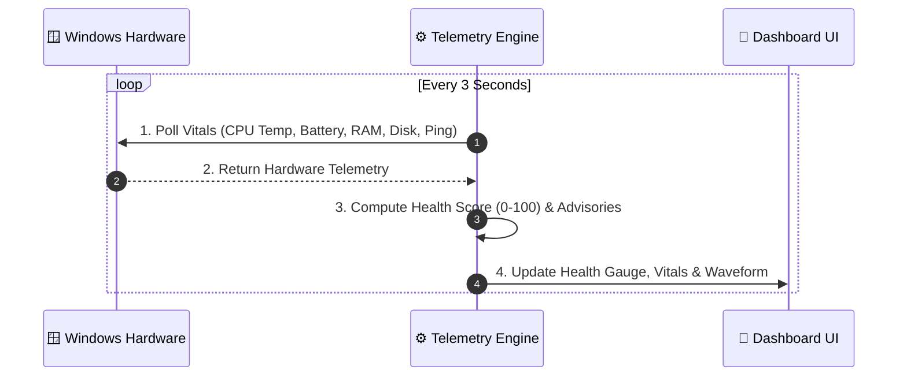

# MobPulse & Laptop Health Suite Pro 📱💻

[](https://www.python.org/)
[](https://github.com/TomSchimansky/CustomTkinter)
[](https://developer.android.com/jetpack/compose)
[](https://kotlinlang.org/)
[](https://opensource.org/licenses/MIT)

A unified hardware vitals, battery wear, system diagnostics, and performance optimization suite for **Laptops (Desktop Python Suite)** and **Mobile Devices (Android Jetpack Compose)**.

---

## 🏛️ System Architecture

```mermaid
graph TD
    A["🖥️ Windows Hardware & Kernel<br/>(ACPI Thermals, Battery, RAM, Disks, Wi-Fi)"]
    B["⚙️ Telemetry & Scoring Engine<br/>(Health Score, Turbo RAM Purge, SSD Benchmark)"]
    C["🎨 CustomTkinter Dashboard<br/>(Circular Health Gauge, Vitals Cards, Vector Waveform)"]
    D["💾 Persistence & Export<br/>(HTML Dashboard Report, CSV Logs, Text Audit)"]

    A -->|Raw Telemetry| B
    B -->|Live Metrics & Score (0-100)| C
    B -->|Export & Stream| D
```

---

## 🔄 Real-Time Telemetry Workflow



---

## ⚡ Turbo RAM Purge Workflow


---

## 🚀 Key Laptop Features

- **📊 0–100 Health Score:** Weighted index of Battery Wear (25%), CPU Thermals (20%), RAM (20%), Disk (20%), and Network (15%).
- **⚡ Turbo RAM Purge:** Windows API (`EmptyWorkingSet`) frees standby memory without closing apps.
- **🔋 Battery Lab:** True wear degradation index (%), cycle count, and 1-click Power Plan switcher.
- **🗄️ Storage & Benchmark:** Real-time Disk I/O, 32MB SSD speed test, and temporary junk cleaner.
- **🌐 Network Radar:** Ping latency, micro-jitter stability, Wi-Fi signal %, and live throughput.
- **📈 Live Analytics & Stress Test:** Multi-metric vector chart and multi-core CPU stress benchmark.
- **📑 Diagnostic Reports:** Generates dark-mode HTML dashboard and text audit logs on Desktop.

---

## 📱 Mobile App — MobPulse (Android)

- **🔋 Battery Trend Graph:** Charge/discharge curves over time.
- **🕒 Background Tracking:** Health logging every 15 mins via `WorkManager`.
- **🌐 Network Radar & 🧠 Lag Diagnostics:** Wi-Fi signal, latency tests, and thermal throttling checks.

---

## 🏃 Quick Start (Laptop Suite)

```bash
cd laptop_health_analyzer
pip install -r requirements.txt
python main.py
```

---

## 📄 License
MIT License. Created by [kailash6207](https://github.com/kailash6207).
