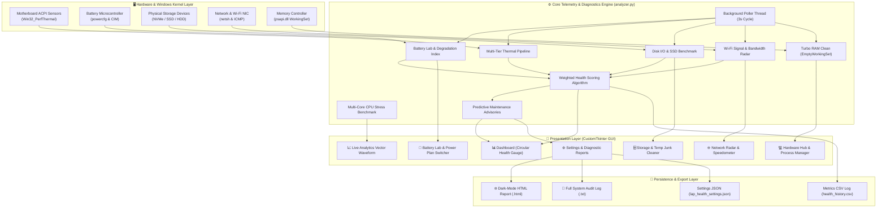
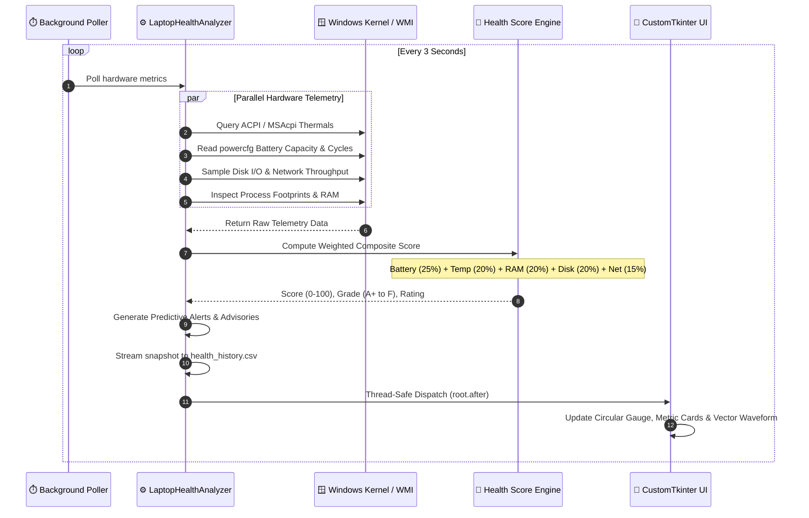
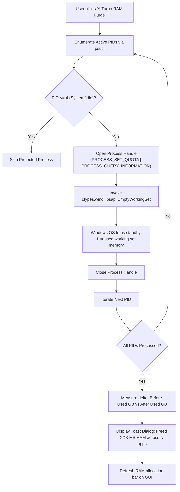

# ⚡ Laptop Health Suite Pro — Ultimate Edition 💻

[](https://www.python.org/)
[](https://github.com/TomSchimansky/CustomTkinter)
[](https://opensource.org/licenses/MIT)

A multi-threaded native Windows hardware telemetry, diagnostics, and system optimization suite built with **CustomTkinter** and **Python 3.12**.

Equipped with low-level kernel hooks (`MSAcpi_ThermalZoneTemperature`, CIM/WMI hardware counters, `powercfg`, and Windows Working Set memory optimization APIs), this suite delivers real-time hardware telemetry, automated health scoring, deep battery degradation analysis, active memory purging, SSD speed benchmarking, network radar, and professional dark-mode HTML audit reports.

---

## 🏛️ System Architecture



---

## 🔄 Real-Time Telemetry & Health Scoring Workflow



---

## ⚡ Turbo RAM Purge Engine Workflow



---

## 🚀 Key Features

- **📊 Hardware Vitals Dashboard:** Real-time monitoring of CPU core load %, frequencies, RAM allocation, battery level %, and storage space.
- **⚡ Overall Laptop Health Score (0–100):** Weighted multi-variable scoring model evaluating Battery Wear (25%), CPU Thermals (20%), Memory Pressure (20%), Disk Space (20%), and Network Latency (15%).
- **🧠 Interactive Process Manager & Turbo RAM Purge:** Live sortable process table with process termination and 1-click `EmptyWorkingSet` memory optimization.
- **🔋 Battery Lab & Wear Analysis:** Design vs. Full Charge capacity wear degradation index (%), cycle count, and Windows Power Plan switcher (*Balanced*, *High Performance*, *Power Saver*, *Ultimate Power*).
- **🗄️ Storage Deep Dive & SSD Benchmark:** Live Disk I/O throughput (MB/s), sequential speed benchmark test, and temporary junk file cleaner.
- **🌐 Network & Wi-Fi Radar:** Ping latency, micro-stutter jitter stability, Wi-Fi signal %, and live upload/download bandwidth.
- **📈 Real-Time Analytics & CPU Stress Test:** Multi-metric vector waveform graph and multi-core CPU stress benchmark.
- **📑 HTML & Text Diagnostic Audit Reports:** Generates professional reports directly to the Desktop.

---

## 🏃 Quick Start

```bash
cd laptop_health_analyzer
pip install -r requirements.txt
python main.py
```
